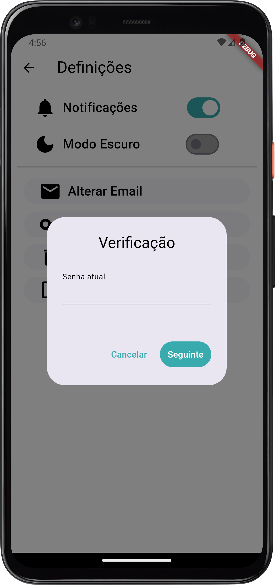
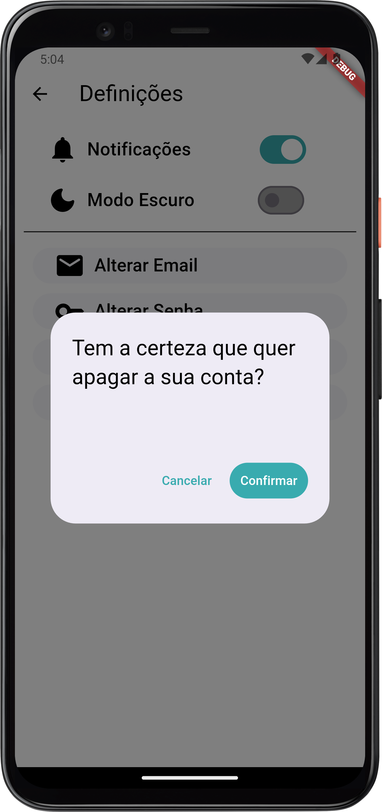

# Como apagar uma conta no PoliTrack

### Aceda a definições
Estando com a sua sessão iniciada, acesse ao menu lateral e clique em definições no canto inferior esquerdo

### Clique em "Apagar Conta"
A partir das definições, clique em "Apagar Conta"

### Confirme a sua Password
Introduza a sua password da conta de PoliTrack para confirmar que deseja apagar a sua conta.

### Apague a Conta
Clique em "Confirmar" e a sua conta irá ser apagada.

# O que é apagado?

Apagando a sua conta PoliTrack, nós apagaremos todos os seus dados como o nome de utilizador, a password, os seus likes, dislikes e iniciativas guardadas da nossa base de dados.